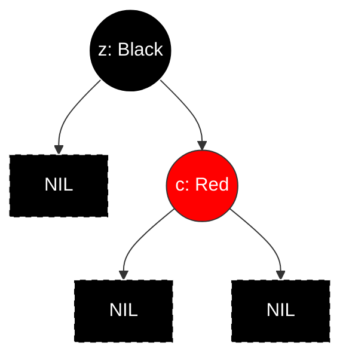

# RB-Delete

```
RB-DELETE(T, z)
y = z
y_original_color = y.color
if z.left == T.nil
    x = z.right
    RB-TRANSPLANT(T, z, z.right)         // replace z by its right child
elseif z.right == T.nil
    x = z.left
    RB-TRANSPLANT(T, z, z.left)          // replace z by its left child
else y = TREE-MINIMUM(z.right)           // y is z's successor
    y_original_color = y.color
    x = y.right
    if y != z.right                      // is y farther down the tree?
        RB-TRANSPLANT(T, y, y.right)     // replace y by its right child
        y.right = z.right                // z's right child becomes y's right child
        y.right.p = y
    else x.p = y                         // in case x is T.nil (???)
    RB-TRANSPLANT(T, z, y)               // replace z by its successor y
    y.left = z.left                      // and give z's left child to y, which had no left child
    y.left.p = y
    y.color = z.color
if y-original-color == BLACK             // if any red-black violations occurred,
    RB-DELETE-FIXUP(T, x)                // correct them
```

## My Interpretation

In terms of tree structure, there is only one case: the actual node that got removed is one with at most $1$ tree node children (i.e. not counting NIL); we do not want to deal with nodes with two proper tree node children.
When the node to delete, $z$, itself has zero or one tree node children, we delete it right in the first two arms.
When $z$ has two real children, successor of $z$ is well-defined within right subtree. What we do in the last if-else arm is effectively swap the two nodes, $z$ and it's well-defined successor $y$, then delete the _location_ in tree where $z$ now lives at. In particular, $y$ would inherit both $z$'s original location _and_ the _color_ of $z$.

In particular, in the PoV of RB tree properties e.g. black height, in the end right before `RB-DELETE-FIXUP`, $x$ would always point to a _location_ in the tree wherein lives the root of some subtree _of which black height contribution passing through it might have changed_.

In other words, the _location_ of some tree node that got purged, such that there used to live some larger subtree (under which lives $x$ and its further subtree) rooted here, and now it is $x$ and its subtree. This disturbs black height calculation from root to the `NIL` under the subtree.

If the _location_ used to be a proper tree node holding `RED`, there's nothing todo: `RED` may have either $2$ `BLACK` proper tree node children or $2$ `NIL`. Since the location is chosen to be not having two tree node children, it's the latter case, and _black height calculated via this location_ does not change.
If the _location_ used to be a proper tree node holding `BLACK`, having at most one proper tree node child, the child, if it exists, must be `RED`, itself having no further proper descendants in order to satisfy the black height calculation passing through the _location_. Which means the black height calculation passing through this _location_ changed (assuming the _location_ which held `BLACK` is not root): from root's PoV, this subtree used to contribute exactly $2$, the _location_ itself living some `BLACK` node and the `NIL`, and now this subtree contributes only $1$ black height, i.e. `NIL`.

This is why `RB-DELETE-FIXUP` starts from the pointer `x`: it's the location that from root's black height calculation PoV might have changed, the newcomer that occupies the _location_ that got purged.

## Remark

Ackchyually why not classify node color and their children?

| node $\setminus$ child | no child (2 `NIL`) | one `RED`        | one `BLACK` | two `RED`        | two `BLACK`      |
| ---------------------- | ------------------ | ---------------- | ----------- | ---------------- | ---------------- |
| `RED`                  | ok                 | no               | no          | no               | ok               |
| `BLACK`                | ok<sup>[1]</sup>   | ok<sup>[3]</sup> | no          | ok<sup>[2]</sup> | ok<sup>[1]</sup> |

### Footnotes

1. a perfect binary tree may well be all `BLACK`
2. a perfect binary tree may well be all `BLACK` except last level which is all `RED`
3. a `BLACK` with one child must be near `NIL`



