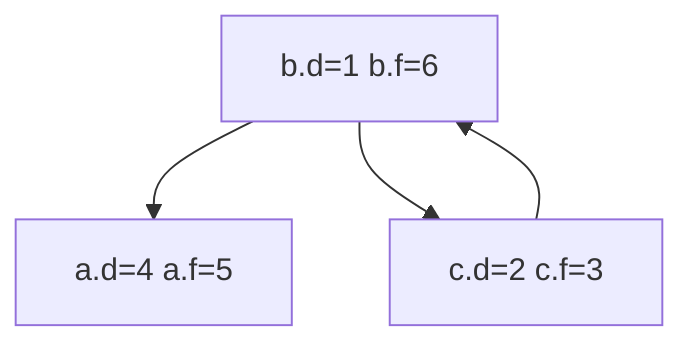

Here's the CLRS 4th pseudo code implementation:

```
STRONGLY-CONNECTED-COMPONENTS(G):
    1 call DFS(G) to compute finish times u.f for each vertex u
    2 create G^T
    3 call DFS(G^T), but in the main loop of DFS, consider the vertices in order of decreasing u.f (as computed in line 1)
    4 output the vertices of each tree in the depth-first forest formed in line 3 as a separate strongly connected component
```

Overall this algorithm feels a lot the same vibe as topological sort:
normally given edge $(u, v)$, we know only $v.d < u.f$, but in _directed acyclic graph DAG_ we know better, namely $u.d < v.d < v.f < u.f$ i.e. if $(u, v)$ then v must be descendant to u.
Thus if we list all the vertices in _decreasing finish time order_, we know that the list is topologically sorted, since it satiesfies every edge in the given DAG.

How is this relate to SCC, though?
Note the SCC quotient graph must be DAG, for we defined strongly connected components to be maximal.
We may define discovery time and finish time for any given strongly connected component to be respectively the minimum discovery time and maximum finish time of the vertices within; such a definition is nice as it mirrors exactly the above lemma discussed in topological sort, namely, if we have two SCC components $A \neq B$, and there's some edge $(a \in A, b \in B)$, then $A.f > B.f$ (lemma 20.14).

This explains why we need $G^T$ and the _largest finish time_: the vertex $v$ with maximum finish time must lie in some SCC $V$. Such SCC is nice since for any $U$ that have some path to $V$, those $U$ must have an _even larger finish time_, which is false since $v$ is the maximum, meaning there's no other SCC $U$ to $V$, meaning in $G^T$, there's _no way out from $V$_. Thus a simple DFS on any point in $V$, in particular $v$, outputs vertices iff they're in $V$.

So the algorithm works, but why we need $G^T$?

First, discovery time is of little help, simply because there's too many choices.
So the natural question is, if we may know the SCC $V$ with _minimum_ finish time, then $V$ has no way out in $G$, which should then just... work?
Problem is, it's **non-trivial** knowing which $V$ has the minimum finish time: vertex with _minimum_ finish time may _not_ be inside SCC with minimum finish time.


