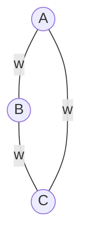

# Undirected $G$ with distinct edge weights, then its minimum spanning tree MST is the subset of edges where they are light edges of some cut

Note that distinct edge weights leads to unique MST: say $T_1 \neq T_2$ both are MST, then some $T_2 \cup \{e_1 \in T_1 \setminus T_2\}$ contains cycle;
distinct weights s.t. there exists unique _heaviest_ edge amongst the cycle,
but that edge cannot be in _any_ MST by the cycle property.

## $e$ in some MST then $e$ is light edge across some cut

Say $e = (\mu, \nu)$.
Consider cut $\{ x \vert x \overset{G \setminus \{(\mu, \nu)\}}{\leftrightsquigarrow} \mu \}$ and $\{ x \vert x \overset{G \setminus \{(\mu, \nu)\}}{\leftrightsquigarrow} \nu \}$ i.e. those still reachable to $\mu$/$\nu$ in $G$ sans $e$.

Note that $T \setminus \{ e \}$, a subset of our initial known MST $T$, is respected by the cut.
Thus theorem 21.1 applies: light edge crossing the cut is _safe_.

Edge weights being distinct, there's gotta be unique light edge across this cut, but the end result must be $T$ since distinct edge weights leads to uniqueness of MST.
We conclude that $e$ must itself be light edge across this cut.

(This is basically exercise 21.1-3)

## $e$ light edge across _some_ cut, then $e$ must be in MST

This is basically simply theorem 21.1.
In particular we have the privilege that there's only one MST since edge weights are distinct, the light, thus safe, edge $e$ across _some_ cut must be in the MST $T$.

# The set of edges which are light edge of some cut may not be a MST

As we've argued, when edge weights are distinct, the unique MST _is_ the set of edges that are light edge across some cut. So this demands a graph with possibly the same weight across edges.
Thus a simple example would be a triangle with equal weights:

